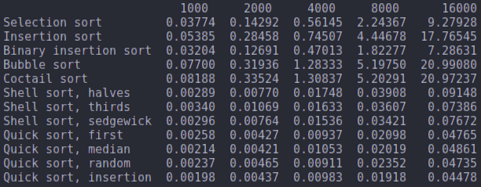

# Sorting algorithms. Comparison of performances
One of the most crucial operations in computer science is to sort a given list, that is to reorder its elements, such that every item is greater or equal to the previous one. Many sorting algorithms have been developed throughout the time and we can assess which ones are better than others using a metric based on their computational complexity. This core characteristic comes in two flavours: time complexity, or how much longer will the algorithm run when we increase the size of the list, and space complexity, or how much more resources it will use. This project is an implementation of chosen sorting algorithms that compares their individual runtimes against the same datasets to observe their time complexity in action.

